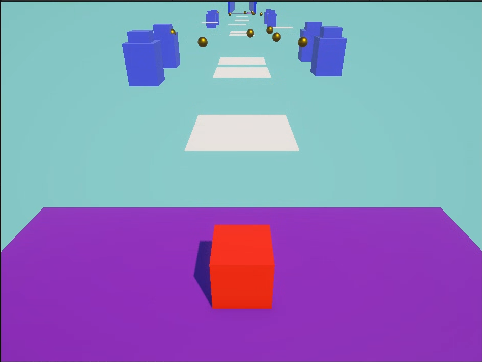
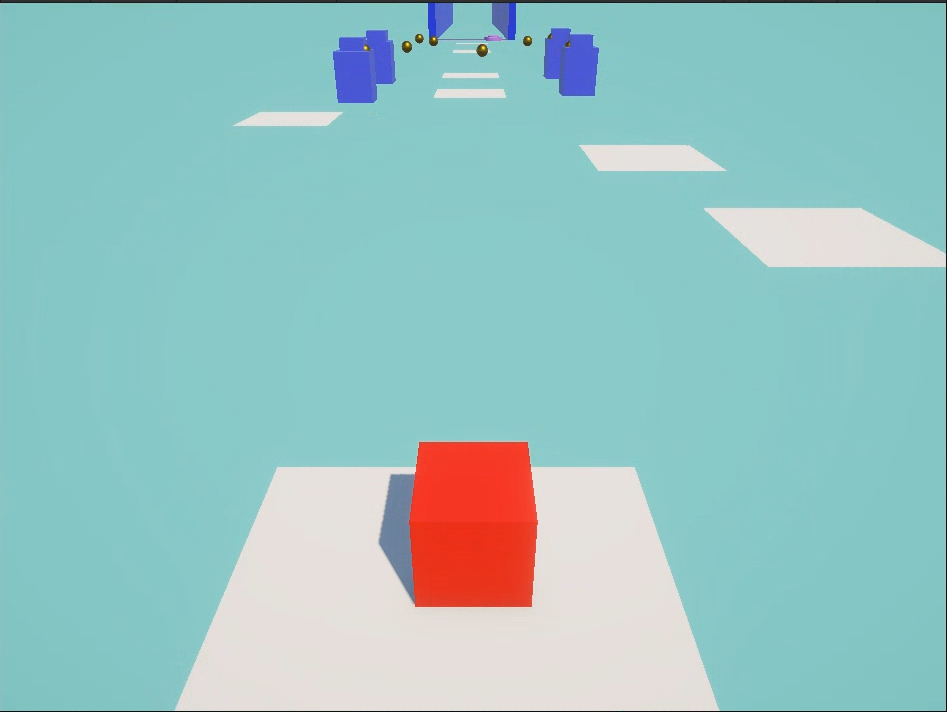
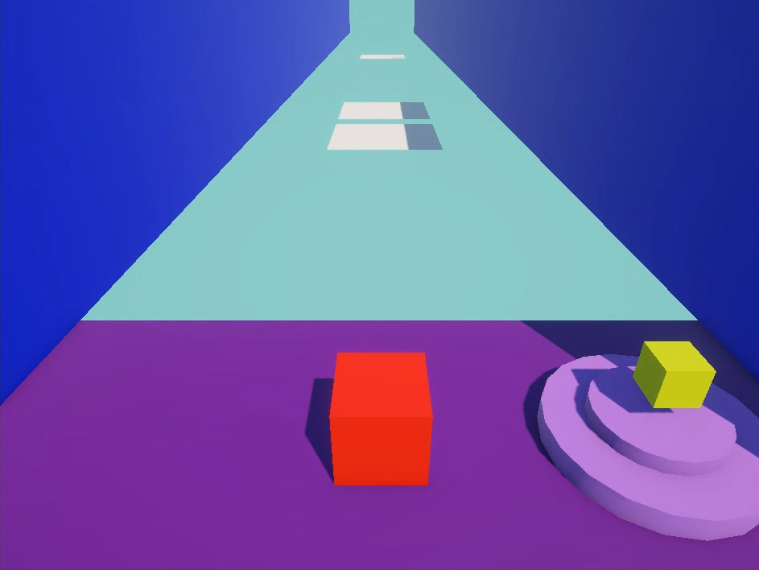
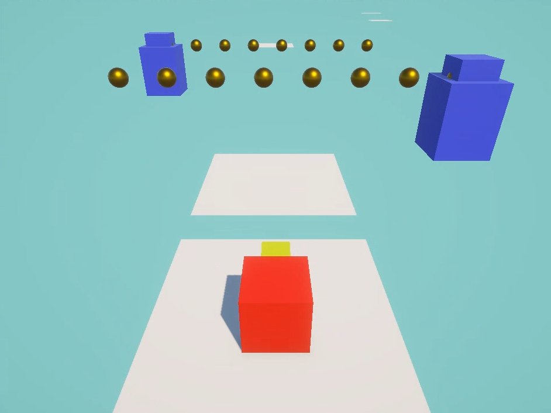
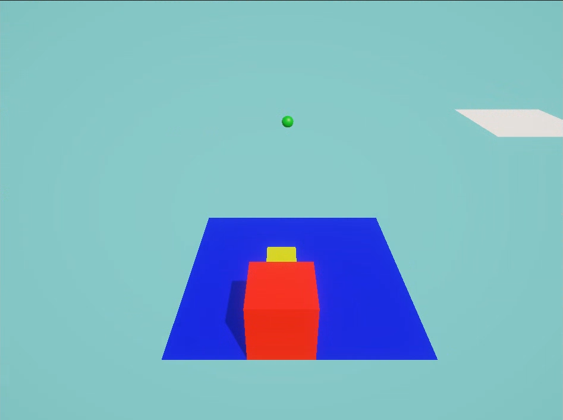
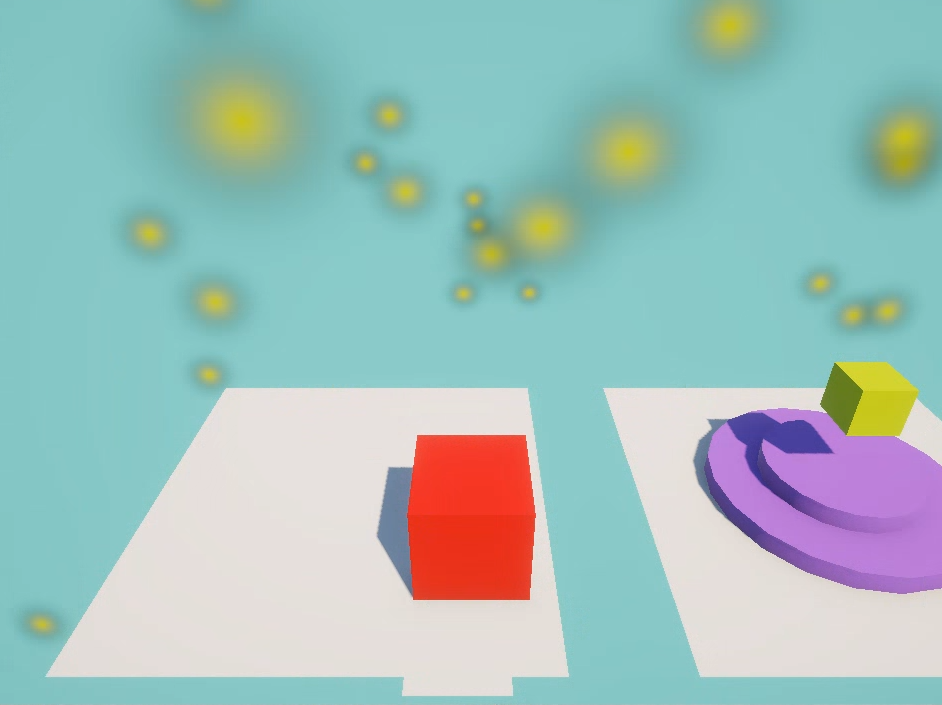
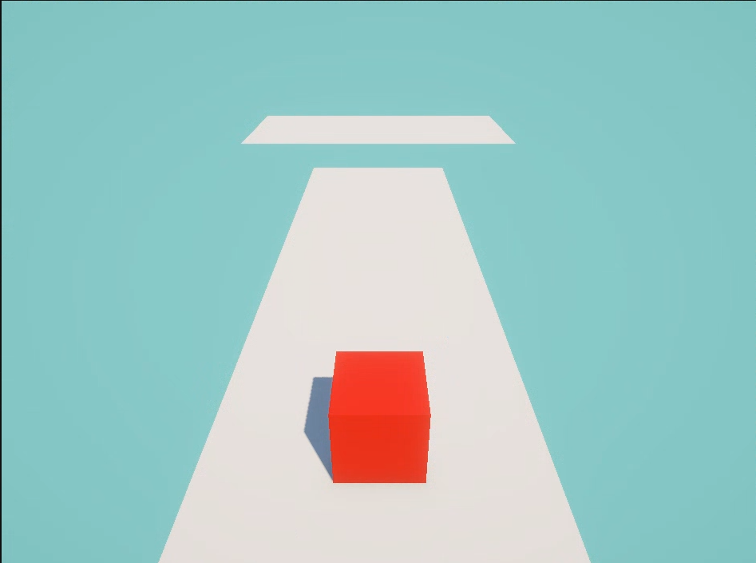
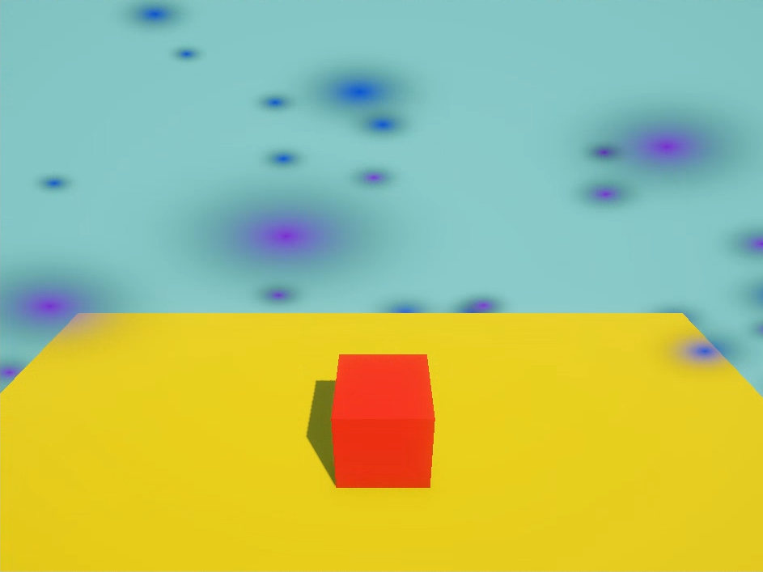

# PARKOUR 3D: El Cubo Rojo
> Asignatura: Programación de Videojuegos I 
Carrera: Tecnicatura Universitaria en Diseño Integral de Videojuegos (TUDIVJ) — UNJu 
Trabajo Práctico N° 1: Entorno Interactivo 3D, Temporizadores y Git/GitHub 
Estudiante: Carla Dalila Angelo 
LU: TUV000563
Equipo Docente: Mg. Ing. Ariel Alejandro Vega | Tecn. Kevin Alexis Roman Llampa

___
## 🛠️ Version de Unity

> Unity: Unity 6.3 LTS
Proyecto: 3D
Lenguaje: C#
___

## 🎮 Descripcion del Proyecto
Juego de plataformas 3D en el que el jugador debe completar un recorrido de parkour de 2 niveles hasta llegar a la meta. Superar plataformas, esquivar obstaculos, entregar un objeto y obtener la Victoria
___
## 🕹️ Controles del Jugador
| Accion | Tecla/Boton | Descripcion|
|-----|-----------|--------|
| **Movimiento** | `W` , `A` , `S` , `D` / `Flechas` | Mueve al personaje por el escenario |
| **Saltar** | `ESPACIO` | Saltar entre plataformas |
| **Interactuar** | `E` / Contacto con zona (`Trigger`) | Recolectar el objeto clave o activar Power-Up |

___
## ⚙️ Mecanicas
- **Plataformas moviles**

El Juego contiene plataformas que se desplazan de punto A hacia punto B. El movimiento es continuo y se utiliza ```Invoke()``` para temporizar el cambio de direccion

- **Proyectiles**
El escenario cuenta con un generador de proyectiles (```BulletSpawner```) que utiliza ```InvokeRepeating()``` para instanciar balas que chocan con el jugador. Se destruyen despues de un tiempo para evitar una acumulacion de objetos

- **Recoleccion**
El jugador puede recoger un objeto presionando E. Al recogerlo el jugador se emparenta mediante ```SetParent()``` permiento transportarlo durante el recorrido. Al llegar a la zona de entrega, el objeto deja de ser transportado por el jugador y pasa a formar parte de la zona de entrega

- **PowerUp: Doble Salto**
Durante el recorrido se encuentra un PowerUp, una esfera verde. Al tomarlo, el jugador obtiene el doble salto (Precionando por segunda vez el espacio) por un tiempo limitado. El efecto dura 15 segundo y se implementa mediante una corrutina ```DoubleJump()```. Al finalizar el tiempo, vuelve a su estado original

- **Niveles**
El juego esat dividido en dos niveles. En el primer nivel se debe superar plataformas y esquivar balas. En el segundo nivel aumenta la dificultad y se agrega el objeto a entregar. Al cumplir el objetivo gana el juego

- **Victoria**
Al completar el objetivo, se muestra un mensaje de victoria y se activan efectos visuales de particulas
___

## 📝 Explicacion Tecnica de Codigo:
1. ### Escenario y control del personaje
Script principal: ```PlayerMovement.cs```
Funcionamiento: El script controla el movimiento y el salto del personaje mediante el teclado y utiliza un Rigidbody para aplicar la fuerza de salto

```csharp
 void Update()
 {
     float h = Input.GetAxisRaw("Horizontal");
     float v = Input.GetAxisRaw("Vertical");

     dir = new Vector3(h, 0f, v);

     Vector3 mover = dir.normalized * walkSpeed * Time.deltaTime + externalMoveSpeed * Time.deltaTime;

     transform.Translate(mover, Space.Self); // Se mueve en el eje local (Space.Self)

     if (Input.GetKeyDown(KeyCode.Space) && jumpCount < maxJumps)
     {
         rb.AddForce(Vector3.up * JumpForce, ForceMode.Impulse);
         jumpCount++;
     }
 }
```

2. ### Plataforma movil e ```Invoke()```
Script principal: ```MovingPlatform.cs```
Funcionamiento: El Script mueve las plataformas de Punto A a Punto B y se utiliza ```Invoke()``` para temporizar el cambio de direccion

```csharp
   void Update()
   {
      float distanceToTarget = Vector3.Distance(transform.position, currentTarget);

      if (distanceToTarget < proximityThreshold && !waiting)
      {
           transform.position = currentTarget;
           waiting = true;
           Invoke("ChangeDirection", waitTime);
       }

       dir = (currentTarget - transform.position).normalized;
       transform.position += dir * speed * Time.deltaTime;
   }

   private void ChangeDirection()
   {
       currentTarget = currentTarget == pointA.position ? pointB.position : pointA.position;
       waiting = false;
   }
```

3. ### Generador de obstaculos e ```InvokeRepeating()```
Script principal: ```BulletSpawner.cs```
Funcionamiento: El Script genera balas mediante ```InvokeRepeating()```

```csharp
   private void Start()
   {
       InvokeRepeating("ShootFast", initTime, interval);
   }

   public void ShootFast()
   {
       GameObject newBullet = Instantiate(bullet, transform.position, transform.rotation);
       Destroy(newBullet, 4f);
   }
```

4. ### Recoleccion y transporte mediante ```SetParent()```
Script principal: ```PickItem.cs```
Funcionamiento: Se utiliza para recoger el objeto y emparejarlo

```csharp
    private void Pick(GameObject item)
    {
        currentItem = item;

        item.transform.SetParent(zone);
        item.transform.localPosition = Vector3.zero;
        item.transform.localRotation = Quaternion.identity;

        Collider collider = item.GetComponent<Collider>();
        if (collider != null) collider.enabled = false;
    }

    public GameObject DropItem()
    {
        GameObject temp = currentItem; // Guarda temporalmente el item actual
        currentItem = null; // Deja de llevar el objeto
        return temp; // Devuelve el item
    }
```

5. ### Potenciador temporal con corrutina
Script principal: ```DoubleJumpPowerUp.cs```
Funcionamiento: El Script maneja la activacion del PowerUp
### DoubleJumpPowerUp.cs

```csharp
    private void OnTriggerEnter(Collider other)
    {
        if (other.CompareTag("Player"))
        {
            PlayerMovement player = other.GetComponent<PlayerMovement>();
            if (player != null)
            {
                player.EnableDoubleJump();

                GetComponent<MeshRenderer>().enabled = false;
                GetComponent<Collider>().enabled = false;
            }
        }
    }
```

### PlayerMovement.cs

```csharp
    private IEnumerator DoubleJump()
    {
        doubleJumpActive = true;
        maxJumps = 2; // Doble salto
        Debug.Log($"<color=cyan>Doble Salto </color><color=green>ACTIVADO</color>");

        yield return new WaitForSeconds(doubleJumpTime);

        doubleJumpActive = false;
        maxJumps = 1;
        Debug.Log($"<color=cyan>Doble Salto </color><color=red>DESACTIVADO</color>");
    }

    public void EnableDoubleJump()
    {
        if (!doubleJumpActive)
        {
            StartCoroutine(DoubleJump());
        }
    }
```

6. ### Entrega del objeto y evento de victoria
Script principal: ```GoalZone.cs``` y ```WinBehavior.cs```
Funcionamiento: El ```GoalZone.cs``` se utiliza para la entrega del objeto y activael camino al evento final. ```WinBehavior.cs``` cambia de color la plataforma y activa particulas y un mensaje por consola, para simbolizar la Victoria del juego

### GoalZone.cs
```csharp
        if (other.CompareTag("Player") && !completed)
        {
            PickItem pickItem = other.GetComponent<PickItem>();
            if (pickItem != null)
            {
                GameObject item = pickItem.DropItem();

                if (item != null)
                {
                    ItemInZone(item);
                    Debug.Log($"<color=magenta>El Objeto esta en su lugar!</color>");
                    completed = true;
                    particles.Play();
                }
                else
                {
                    Debug.Log($"<color=red>Falta el Objeto</color>");
                }
            }
        }
    }

    private void ItemInZone(GameObject item)
    {
        item.transform.SetParent(goal);
        item.transform.localPosition = new Vector3(0f, 5f, 0f);
        item.transform.localRotation = Quaternion.identity;

        Collider collider = item.GetComponent<Collider>();
        if (collider != null) collider.enabled = true;
    }
```

### WinBehavior.cs

```csharp
    private void OnTriggerEnter(Collider other)
    {
        if (other.CompareTag("Player"))
        {
            Debug.Log("<color=yellow>GANASTE!!! Felicidades, lograste sobrevivir</color>");
            GetComponent<Renderer>().material.color = Color.yellow;
            confetiL.Play();
            confetiR.Play();
        }
    }
```
___

## 📸 Capturas de Pantalla
### Nivel 1



### Nivel 2





### Victoria



___

## ▶️ Como abrir y ejecutar el proyecto

1. Descargar o clonar el repositorio desde GitHub.
2. Abrir Unity Hub.
3. Seleccionar **Add project from disk** y elegir la carpeta del proyecto
4. Abrir el proyecto utilizando **Unity 6.3 LTS**
5. Abrir la escena principal ubicada en `Assets/Scenes/`
6. Presionar **Play** para ejecutar el juego
7. Utilizar los controles indicados en la seccion **Controles del Jugador**
___
## 📚 Bibliografia
- [README.md - Markdown](https://markdown.es)
- [Plataformas moviles - Youtube](https://www.youtube.com/watch?v=AoLR6pMkkZQ)
- [Material de clase — Programacion de Videojuegos I](https://virtual.unju.edu.ar/course/view.php?id=2520)
- Apuntes y ejemplos dados durante las clases de Programacion de Videojuegos I